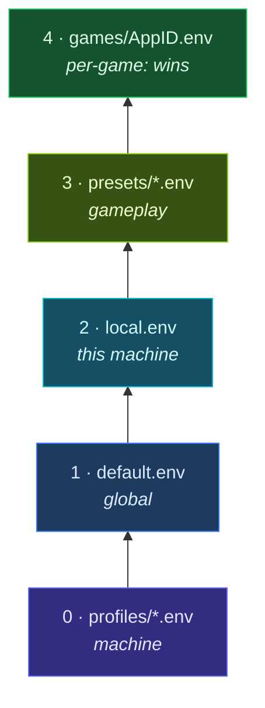

<div align="center">


# LaunchLayer

**One launch command, layered settings, and repeatable Steam game tuning on Linux**

*Use the same Steam launch string for every game. Keep each game's settings in a plain config file.*

[](LICENSE)
[](https://github.com/bolens/launch-layer/actions/workflows/ci.yml)
[](launchlayer)
[](launch.d/profiles/)

[Player guide](https://bolens.github.io/launch-layer/) · [Technical documentation](docs/README.md) · [Interactive architecture](https://bolens.github.io/launch-layer/architecture.html)

</div>

LaunchLayer is for Linux players who use GameMode, CPU affinity, MangoHUD, Gamescope, VRAM controls, or network settings. Put it before `%command%` in Steam's **Launch Options**. It loads the applicable config files, checks the host, and builds the wrapper chain before starting the game.

| Without LaunchLayer | With LaunchLayer |
|---------------------|------------------|
| `gamemoderun mangohud gamescope -W 3440 … %command%` pasted per game | `"/path/to/launchlayer" %command%` once per game |
| Settings scattered across Steam, shell aliases, and one-off scripts | Plain `KEY=VALUE` files: profiles → presets → per-game |
| No preflight for `vm.max_map_count`, shader bloat, or VRAM pressure | Doctor, cache trim, compositor-aware display detection |

The project began on a 7900X3D and RTX 3080 Ti workstation running Wayland and Plasma 6. Detection and profiles also cover Steam Deck, Flatpak Steam, BSD, and WSL2.

**Requirements:** Bash 4.3+, Steam (or any launcher that passes `%command%`). Optional tools (`fzf`, `gamescope`, …) extend the stack but are not required for basic launches.

### Preview a launch

Preview the resolved layers and launch chain without starting a game:

```bash
./launchlayer --show-config 2357570
```

```
=== Config for AppID 2357570 (Overwatch®) ===
Layers:
  → profiles/arch-linux.env
  → profiles/nvidia-desktop.env
  → default.env
  → presets/competitive.env
  → games/2357570.env

Launch chain:
  gamemoderun → taskset → game-performance → dlss-swapper → gamescope → %command%
```

<p align="center">
  
  <br>
  <em><a href="docs/tui.md#screenshots">Interactive TUI</a>: browse games, preview configs, flip toggles</em>
</p>

### Find a topic

| I want to… | Go to |
|------------|-------|
| Install and configure LaunchLayer | [Quick start](#quick-start) |
| Read the non-technical guide | [GitHub Pages](https://bolens.github.io/launch-layer/) |
| Paste into Steam's Launch Options | [Steam integration](#integrating-with-steam-launch-options) |
| Browse and edit games interactively | [Interactive TUI](#interactive-tui) · [screenshots](docs/tui.md#screenshots) |
| Share configs with similar machines | [Community hub](#community-hub) |
| Understand the launch pipeline | [How a launch works](#how-a-launch-works) |
| Full CLI command tables | [docs/cli.md](docs/cli.md) |
| TUI menus and shortcuts | [docs/tui.md](docs/tui.md) |
| Module-level internals | [docs/architecture.md](docs/architecture.md) |
| Licenses / inject / nest Gamescope | [docs/third-party.md](docs/third-party.md) |
| Find the canonical page for a topic | [docs/README.md](docs/README.md) |

---

## Contents

| | Section |
|:---:|---------|
| ▶ | [Quick start](#quick-start) |
| ◆ | [Steam launch options](#integrating-with-steam-launch-options) |
| · | [What it does](#what-it-does) |
| ⚙ | [How a launch works](#how-a-launch-works) |
| ≡ | [Configuration](#configuration) |
| ⌨ | [CLI reference](docs/cli.md) |
| ▤ | [Interactive TUI](#interactive-tui) · [docs/tui.md](docs/tui.md) |
| ◉ | [Community hub](#community-hub) |
| ⊞ | [System tuning](#system-tuning) |
| ⚖ | [Third-party licenses](docs/third-party.md) |
| ☰ | [Docs index](docs/README.md) |
| / | [Project layout](#project-layout) |
| + | [Optional dependencies](#optional-dependencies) |
| ✓ | [Testing](#testing) · [Release runbook](docs/release_runbook.md) · [Changelog](CHANGELOG.md) |
| ? | [FAQ](#faq) |
| ↗ | [Contributing](#contributing) |
| § | [License](#license) |

---

## Quick start

1. **Clone to a stable path** (Steam needs a fixed absolute path in Launch Options):

```bash
git clone https://github.com/bolens/launch-layer.git ~/launchlayer
cd ~/launchlayer
```

2. **Run onboarding**: completions, symlink, launch string, and machine defaults:

```bash
./launchlayer --setup --completions --symlink --print-launch-option --write-local-config
```

The command installs shell completions, adds `~/.local/bin/launchlayer`, prints the Steam launch string, and writes `launch.d/local.env`. Add `--systemd` to install the maintenance timer or `--backup-timer` to schedule config backups.

3. **Paste into Steam**: copy the printed string into each game's **Launch Options** (same string for every title):

```
"$HOME/launchlayer/launchlayer" %command%
```

See [Integrating with Steam launch options](#integrating-with-steam-launch-options) for UI paths, Flatpak notes, and verification.

4. **Scaffold a per-game config**:

```bash
./launchlayer --init-appid 2357570 competitive    # by AppID
./launchlayer --init-appid "Overwatch" competitive  # by name
./launchlayer --tui                                 # or browse interactively
```

5. **Check the installation**:

```bash
./launchlayer --doctor
```

If Proton titles misbehave, fix `vm.max_map_count` once. See [System tuning](#system-tuning).

---

## Integrating with Steam launch options

LaunchLayer prefixes Steam's normal game command. Steam replaces `%command%` with its Proton wrappers, the game binary, and existing arguments. LaunchLayer loads config, runs its preflight checks, builds the wrapper chain, and executes that command.

Use the **same launch string on every game** you want managed. Per-game tuning lives in `GAMES_DIR/<AppID>.env`. You do not need different launch options per title.

### 1. Get your launch string

Run onboarding (recommended) or print the string alone:

```bash
./launchlayer --setup --symlink --print-launch-option
# or
./launchlayer --setup --print-launch-option
# or (also printed at the end of doctor)
./launchlayer --doctor
```

Example output:

```
"$HOME/launchlayer/launchlayer" %command%
```

| Approach | Launch string | Notes |
|----------|---------------|-------|
| **Absolute path** (recommended) | `"$HOME/launchlayer/launchlayer" %command%` | Most reliable. Steam's environment often has a minimal `PATH`. `--print-launch-option` prints your real path. |
| **Symlink** (after `--setup --symlink`) | `"$HOME/.local/bin/launchlayer" %command%` | Use the full path to the symlink (`realpath ~/.local/bin/launchlayer`). Bare `launchlayer` usually fails in Steam. |

Rules:

- **Keep `%command%`** at the end. Without it Steam never runs the game binary.
- **Quote the script path** when it contains spaces.
- **Do not** substitute the game `.exe` or Proton command for `%command%`. LaunchLayer receives the full Steam-built argv automatically.
- **Replace** other wrapper prefixes (`gamemoderun %command%`, `mangohud %command%`, `sd0 %command%`, etc.) with LaunchLayer. Enable those features in config instead (`GAMEMODE=1`, `MANGOHUD=1`, `DISABLE_STEAM_DECK=1`, …).

### 2. Paste into Steam

**Per game** (typical workflow, repeat for each title, or copy/paste the same string):

1. Open **Steam** → **Library**
2. Right-click the game → **Properties**
3. In **General**, find **Launch Options**
4. Paste your launch string, e.g. `"$HOME/launchlayer/launchlayer" %command%`
5. Close Properties and launch the game normally

<details>
<summary>Steam Deck / Big Picture</summary>

On Deck: **Library** → select game → **gear icon** → **Properties** → **General** → **Launch Options**. The same `%command%` string applies.

</details>

### 3. Flatpak Steam

If Steam is installed via Flatpak, the sandbox must read your LaunchLayer install:

- Script under `$HOME` (e.g. `~/launchlayer/…`) → usually works as-is
- Script outside `$HOME` (e.g. `/path/to/launchlayer`) → grant filesystem access:

```bash
flatpak override --user com.valvesoftware.Steam --filesystem=/path/to/launchlayer
```

Check access and get a tailored hint:

```bash
./launchlayer --detect-environment
./launchlayer --doctor
```

The `flatpak-steam` profile layers automatically when Flatpak Steam is detected.

### 4. Per-game settings (no launch-option edits)

After the launch string is set once per game, adjust behavior with per-game configs, not by changing Steam's field again:

```bash
./launchlayer --init-appid 2357570 competitive   # scaffold GAMES_DIR/2357570.env
./launchlayer --edit-appid "Overwatch"             # open in $EDITOR
./launchlayer --show-config 2357570                # resolved layers + launch chain
```

Steam sets `SteamAppId` / `STEAM_APPID` when launching; LaunchLayer uses that to pick `GAMES_DIR/<AppID>.env` (or auto preset when no file exists).

### 5. Verify before or after first launch

**Preview the resolved chain** (terminal, no game start):

```bash
SteamAppId=2357570 ./launchlayer --dry-run %command%
# or
./launchlayer --show-config 2357570
```

**After a real launch**, inspect history:

```bash
./launchlayer --launch-stats 2357570
tail ~/.local/state/launchlayer/launch.log
```

**Health check:**

```bash
./launchlayer --doctor
```

### Troubleshooting

| Symptom | Likely cause | Fix |
|---------|--------------|-----|
| Game starts but LaunchLayer never runs | Launch string missing or wrong game | Confirm **Launch Options** on that title. The path must point to the `launchlayer` script. |
| Game never starts / instant exit | `%command%` omitted | Use `"/path/to/launchlayer" %command%`, not the script alone |
| `Permission denied` or `No such file` | Bad path or Flatpak sandbox | Use an absolute path. For Flatpak Steam, see [Flatpak Steam](#3-flatpak-steam). |
| Wrong preset / no per-game config | No `GAMES_DIR` file yet | `./launchlayer --init-appid APPID preset` or `--tui` |
| Double wrappers / odd behavior | Old launch option left in place | Remove `gamemoderun`, `mangohud`, `dlss-swapper`, `sd0`, etc. from Steam. Configure them through LaunchLayer with `GAMEMODE`, `MANGOHUD`, `DLSS_SWAPPER`, and `DISABLE_STEAM_DECK`. |
| Proton crashes / map errors | Low `vm.max_map_count` | Run `./launchlayer --sysctl install`. See [System tuning](#system-tuning). |

---

## What it does

| | Area | Behavior |
|:---:|------|----------|
| ≡ | **Layered config** | Plain `KEY=VALUE` files stack: profiles → `default.env` → `local.env` → preset → per-game overrides |
| ◦ | **Auto-detection** | Distro, GPU, compositor, display resolution/VRR, X3D V-Cache CPU mask, native vs Proton |
| ⊛ | **Preflight** | Checks `vm.max_map_count`, shader/compat cache size (optional trim), VRAM, GPU power/processes, disk space, concurrent launches |
| ⚡ | **Runtime tuning** | Network (`ethtool`), PipeWire latency, NVIDIA power mode, Proton/DXVK/VKD3D env, shader-cache boost, DLSS/FSR4/XeSS upgrade knobs |
| ◆ | **VRAM management** | Pause configured systemd units such as Sunshine during play, then resume them on exit |
| → | **Launch chain** | `LAUNCH_WRAPPERS_BEFORE` → GameMode → CPU affinity → `game-performance` → DLSS swapper → `LAUNCH_WRAPPERS` → Gamescope (`--mangoapp` when both Gamescope and MangoHUD) → MangoHUD → game |
| ▤ | **CLI + TUI** | Manage configs, backup/restore, doctor checks, optional [Community hub](#community-hub) |

Use `--dry-run %command%` to print the resolved config and chain without starting the game.

---

## How a launch works

When Steam invokes the script, `run_game_launch` in `lib/launch.sh` runs this pipeline:


<details>
<summary>Step-by-step (text)</summary>

1. **Recover stale state**: Resume VRAM-heavy services left paused after a crash (`lib/vram.sh`)
2. **Resolve AppID**: From `SteamAppId`, `STEAM_APPID`, or launch argv (`lib/config.sh`)
3. **Load layered config**: Profiles → `default.env` → `local.env` → preset or per-game file; then `apply_defaults` and `apply_detected_defaults`
4. **Detect game flags**: Native vs Proton, EAC/BattlEye, engine hints (`lib/steam/detect.sh`)
5. **Auto hardware defaults**: X3D CPU mask, display resolution/refresh for Gamescope (`lib/hardware/`)
6. **Parse extra args**: Split `GAME_EXTRA_ARGS` into argv appended after `%command%`
7. **Preflight checks**: Skipped when `BENCHMARK=1` (`lib/preflight.sh`): sysctl, shader/compat caches, VRAM, GPU power/processes, disk, concurrent launch guard
8. **Tool warnings & anticheat guardrails**: Report missing optional tools and warn on risky settings for EAC/BattlEye titles
9. **VRAM hogs**: Optionally pause configured systemd user units with refcount + exit trap (before runtime tuning)
10. **Runtime tuning**: Network (`ethtool`), PipeWire latency, CPU perf profile, NVIDIA power mode, Proton/DXVK/VKD3D env
11. **Build launch chain**: Assemble wrappers per `build_launch_chain` in `lib/runtime/chain.sh`
12. **Exec**: `PRE_LAUNCH_CMD` → run chain + `%command%` + extras → `POST_LAUNCH_CMD`; log to `~/.local/state/launchlayer/launch.log`

</details>

For module-level detail, see [docs/architecture.md](docs/architecture.md). Config-key cheat sheets: [docs/cli.md](docs/cli.md). Inject / license policy: [docs/third-party.md](docs/third-party.md). Docs map: [docs/README.md](docs/README.md).

---

## Configuration

Settings are plain `KEY=VALUE` files. **Later layers override earlier ones.** Full key tables: [docs/cli.md](docs/cli.md). TUI editors: [docs/tui.md](docs/tui.md#quick-toggles).

### Layer order



| Order | File | Purpose |
|------:|------|---------|
| 0 | `launch.d/profiles/*.env` | Machine profiles (auto-detected or via `LAUNCHLAYER_PROFILES`) |
| 1 | `launch.d/default.env` | Global infrastructure defaults |
| 2 | `launch.d/local.env` | Machine-local, gitignored overrides from `--write-local-config`. **Force-overwrites** profile/default keys. |
| 3 | `launch.d/presets/*.env` | Gameplay preset via per-game `INCLUDE=` **or** auto `standard`/`native` when no per-game file |
| 4 | `games/<AppID>.env` | Per-game overrides in `GAMES_DIR` (wins over everything above) |

**Preset loading:** If `GAMES_DIR/<AppID>.env` exists, only that file is loaded (plus its `INCLUDE=` chain). Auto `standard.env` / `native.env` applies only when no per-game file exists. Per-game files usually start with `INCLUDE=presets/competitive.env` (or another preset) and then override individual keys.

After files load, **runtime detection** fills any still-unset keys: NVIDIA checks, VRAM hog filtering, disk thresholds, and platform guardrails (Steam Deck, WSL2, containers). NIC profiles are available for explicit selection but are not auto-selected. NIC and global PipeWire tuning remain off unless you enable them because safe values depend on the hardware and audio graph.

### Where data lives

| Location | Default | Contents |
|----------|---------|----------|
| `LAUNCHLAYER_CONFIG_DIR` | repo root | `launch.d/` shipped layers + optional `local.env` |
| `LAUNCHLAYER_GAMES_DIR` | `~/.local/share/launchlayer/games` | Per-game `<AppID>.env` files |
| `~/.config/launchlayer/` | user prefs | `tui.conf`, `backup.conf`, `hub.conf` |
| `~/.local/state/launchlayer/` | runtime | Launch logs, PID/stamp files (see [Runtime state](#runtime-state)) |

Per-game configs are **not** stored under `launch.d/` in git, only in `GAMES_DIR`. Example: [examples/games/2357570.env](examples/games/2357570.env) (Overwatch 2).

### Auto preset selection

When no per-game `.env` exists:

| | Path |
|:---:|------|
| N | **Native Linux build** → `presets/native.env` |
| P | **Everything else (Proton)** → `presets/standard.env` |

### Presets

| Preset | Use case |
|--------|----------|
| `standard` | Default Proton titles: GameMode on |
| `competitive` | Online / latency-sensitive: extends `standard` with MangoHUD, Gamescope, VRR, VRAM hogs, network tune |
| `lightweight` | 2D / indie: minimal overhead |
| `native` | Native Linux: skips Proton env and cache checks |

Init with: `./launchlayer --init-appid APPID competitive`

### Machine profiles

Profiles in `launch.d/profiles/` layer automatically based on detection, or set explicitly:

```bash
LAUNCHLAYER_PROFILES=steam-deck,flatpak-steam   # comma-separated
# legacy: LAUNCHLAYER_PROFILE=steam-deck
```

| Category | Profiles |
|----------|----------|
| **Distros** | `arch-linux`, `debian`, `fedora`, `suse`, `nixos`, `alpine`, `void`, `gentoo`, `solus`, `clearlinux`, `immutable-linux` |
| **Environment** | `steam-deck`, `flatpak-steam`, `wsl2`, `bsd`, `macos`, `non-systemd` |
| **GPU** | `amd-gpu`, `intel-gpu`, `nvidia-desktop` (auto-layered) |

### Common config keys

Per-game files typically start with `INCLUDE=presets/competitive.env`, then override individual keys:

```bash
# Layering
INCLUDE=presets/competitive.env

# Wrappers and game args
DLSS_SWAPPER=1              # 1=dlss-swapper (NGX+presets), dll=dlss-swapper-dll (presets only)
PROTON_DLSS_UPGRADE=0       # 1=Proton-CachyOS/GE DLSS DLL upgrade (not Valve Proton)
PROTON_FSR4_UPGRADE=0       # 1=FSR4 upgrade (RDNA3 auto → PROTON_FSR4_RDNA3_UPGRADE)
PROTON_XESS_UPGRADE=0       # 1=XeSS upgrade (Intel / forks)
SHADER_CACHE_BOOST=1        # raise Mesa/NVIDIA shader cache size limits
LD_BIND_NOW=0               # 1=eager dynamic linking (Arch Gaming)
DISABLE_VBLANK=0            # 1=Mesa vblank off / immediate present
VKBASALT=0                  # 1=ENABLE_VKBASALT (vkBasalt layer)
VKBASALT_CONFIG_FILE=       # optional path to vkBasalt.conf
LSFG_VK=0                   # lsfg-vk (owned Lossless Scaling required)
OBS_VKCAPTURE=0             # obs-gamecapture / obs-vkcapture after Gamescope
SPECIAL_K=0                 # Special K under Proton (WINEDLLOVERRIDES + optional inject)
RESHADE=0                   # Wine ReShade local inject
OPTISCALER=0                # tracked user-supplied upscaler inject; blocked for anti-cheat games
OPENCOMPOSITE=0             # tracked per-game OpenVR replacement
GPU_SELECT=auto             # hybrid-GPU hint: auto/discrete/nvidia/amd/intel
GAMESCOPE_NESTED_FIX=1      # strip LD_PRELOAD for nested desktop Gamescope
LATENCYFLEX=0               # 1=LFX=1 (LatencyFleX layer)
DISABLE_STEAM_DECK=0        # 1=SteamDeck=0 (Bazzite sd0)
FRAME_RATE=                 # e.g. 60 → DXVK_FRAME_RATE + VKD3D_FRAME_RATE
LAUNCH_WRAPPERS=""          # custom PATH wrappers after DLSS, without dlss-swapper when DLSS_SWAPPER is set
LAUNCH_WRAPPERS_BEFORE=""
GAME_EXTRA_ARGS="-skipintro -nolog"
UNSET_VARS="DXVK_ASYNC VKD3D_CONFIG"

# Hooks are local only. Hub publish rejects non-empty values, and hub apply strips them.
PRE_LAUNCH_CMD=""
POST_LAUNCH_CMD=""

# Flags
FORCE_NATIVE=1    FORCE_PROTON=1
BENCHMARK=1       DEBUG=1

# Features (0/1 unless noted)
GAMEMODE  MANGOHUD  MANGOHUD_CONFIG  MANGOHUD_LOG
GAMESCOPE  GAMESCOPE_W  GAMESCOPE_H  GAMESCOPE_R
GAMESCOPE_ADAPTIVE_SYNC  GAMESCOPE_FSR  GAMESCOPE_FSR_SHARPNESS  GAMESCOPE_HDR
VRAM_HOGS  LAUNCH_WATCHDOG  NETWORK_TUNE  PIPEWIRE_LOW_LATENCY
GPU_POWER_CHECK  NVIDIA_POWER_MODE  GAME_PERFORMANCE  DLSS_SWAPPER
DISABLE_CPU_AFFINITY  CPU_AFFINITY_RANGE  CONCURRENT_LAUNCH_GUARD
DISABLE_NIC_EEE  DISABLE_WIFI_POWER_SAVE  DISK_TUNE
MALLOC_ALLOCATOR  ENABLE_HDR  OVERRIDE_PROTON
PROTON_DLSS_UPGRADE  PROTON_FSR4_UPGRADE  PROTON_XESS_UPGRADE
PROTON_NVIDIA_LIBS  PROTON_NVIDIA_LIBS_NO_32BIT  SHADER_CACHE_BOOST
LD_BIND_NOW  VKBASALT  LATENCYFLEX  DISABLE_VBLANK
DISABLE_STEAM_DECK  FRAME_RATE

# Preflight thresholds
SHADER_CACHE_CHECK  SHADER_CACHE_MAX_GB  SHADER_CACHE_TRIM  SHADER_CACHE_BOOST_GB
COMPATDATA_CHECK  COMPATDATA_MAX_GB  COMPATDATA_TRIM
VRAM_PREFLIGHT_MIN_MB  DISK_PREFLIGHT_MIN_GB  GPU_VRAM_PROCESS_MIN_MB
VM_MAX_MAP_COUNT_MIN  VM_MAX_MAP_COUNT_FIX

# Proton / GPU (passed through when set)
PROTON_*  DXVK_*  VKD3D_*  __GL_*  __VK_*  SDL_*  MESA_*  RADV_*  AMD_*  INTEL_*
```

Inject, capture, Conty, and Wine keys: [docs/cli.md](docs/cli.md) · licenses / purchase gates: [docs/third-party.md](docs/third-party.md) · nest Gamescope: [docs/third-party.md § Nested Gamescope](docs/third-party.md#nested-gamescope-scopebuddy-parity).

### Upscaling paths (DLSS / FSR / XeSS)

See also CachyOS: [Forcing the Latest DLSS Preset](https://wiki.cachyos.org/configuration/gaming/#forcing-the-latest-dlss-preset).

| Approach | When to use |
|----------|-------------|
| `DLSS_SWAPPER=1` | CachyOS `dlss-swapper`: NGX updater + latest SR/RR/FG presets at launch |
| `DLSS_SWAPPER=dll` | Manual DLL replace + `dlss-swapper-dll` (presets only, no NGX) |
| `PROTON_DLSS_UPGRADE=1` | Proton-CachyOS / GE download latest DLSS into the prefix (needs those forks) |
| `PROTON_FSR4_UPGRADE=1` | Same forks for FSR4. RDNA3 GPUs automatically use `PROTON_FSR4_RDNA3_UPGRADE`. |
| `PROTON_XESS_UPGRADE=1` | Same forks for XeSS |
| **dlss-updater** | GUI app to replace game-folder DLLs offline. **No CLI.** LaunchLayer only detects it and prints tips. |

Prefer one DLSS path per game (`DLSS_SWAPPER` *or* `PROTON_DLSS_UPGRADE`) to avoid double upgrades. Do not also list `dlss-swapper` in `LAUNCH_WRAPPERS` when `DLSS_SWAPPER` is set.

### Latency knobs (Arch Gaming)

| Key | Effect |
|-----|--------|
| `LD_BIND_NOW=1` | Eager symbol bind (first-call latency) |
| `DISABLE_VBLANK=1` | Mesa `vblank_mode=0` / immediate present. NVIDIA uses `__GL_SYNC_TO_VBLANK=0`. |
| `VKBASALT=1` | `ENABLE_VKBASALT=1` (vkBasalt Vulkan layer) |
| `LATENCYFLEX=1` | Set `LFX=1` for LatencyFleX. Pair it with `DISABLE_VBLANK=1` when possible. |

### Bazzite / Deck identity & FPS caps

| Key | Effect |
|-----|--------|
| `DISABLE_STEAM_DECK=1` | `SteamDeck=0` (Bazzite `sd0`): full graphics menus when Deck mode locks settings |
| `FRAME_RATE=N` | Sets `DXVK_FRAME_RATE` and `VKD3D_FRAME_RATE`. Requires a restart to change and has the lowest latency of the FPS-cap methods. |

See [Bazzite launch options](https://docs.bazzite.gg/Gaming/launch-options-env-variables/). Prefer LaunchLayer keys over pasting `sd0` / `dlss-swapper` into Steam when using `"…/launchlayer" %command%`.

### Display detection

Cross-compositor probing covers KDE/Plasma, GNOME/COSMIC, Hyprland, Sway, wlroots compositors, and X11 stacks (via xrandr). Compositor IPC probes are gated so inactive tools (e.g. `hyprctl` on KDE) do not false-match. Wayland sessions auto-set `GAMESCOPE_EXPOSE_WAYLAND=0`.

Inspect detection: `./launchlayer --detect-environment` (see [docs/cli.md](docs/cli.md))

---

## Interactive TUI

```bash
./launchlayer --tui          # always opens the TUI (interactive terminal required)
launchlayer                  # same when symlinked, and opens TUI with no args when fzf + TTY
```

Requires [fzf](https://github.com/junegunn/fzf) for fuzzy menus with live previews. Without it, LaunchLayer uses numbered prompts.

<p align="center">
  
  <br>
  <em>Main menu with status banner</em>
</p>

<p align="center">
  
  <br>
  <em>Game picker: fuzzy search, live config preview, Ctrl-E/Ctrl-D shortcuts</em>
</p>

<p align="center">
  
  <br>
  <em>Quick toggles: inherited vs per-game overrides (green/red)</em>
</p>

**Full menu tree, shortcuts, and preferences:** [docs/tui.md](docs/tui.md) (includes [screenshots](docs/tui.md#screenshots))

Regenerate screenshots after UI changes: `make tui-screenshots` (requires [VHS](https://github.com/charmbracelet/vhs) and `fzf`).

---

## MCP server

LaunchLayer includes a local, read-only MCP server for coding agents and desktop assistants:

```json
{
  "mcpServers": {
    "launchlayer": {
      "command": "/absolute/path/to/launchlayer",
      "args": ["--mcp"]
    }
  }
}
```

It exposes game discovery, resolved configuration, paths, cache usage, launch statistics, status, detected defaults, environment checks, diagnostics, and config validation. It cannot launch games or change local or Hub configuration. Python 3.9+ is required. Add `--privacy redacted` to the argument list to suppress local paths and exact hardware identifiers. See [the CLI reference](docs/cli.md#mcp-server) for the full data-sharing boundary.

---

## Community hub

The optional community Hub shares per-game configs and finds settings from machines with similar GPUs, operating systems, displays, profiles, and platform flags. Local launches do not contact it. The client lives in `lib/hub/`; the Convex backend lives in `hub/`.

**Setup**: copy the template and set your deployment URL **and** publish token:

```bash
mkdir -p ~/.config/launchlayer
cp share/launchlayer/templates/hub.conf.example ~/.config/launchlayer/hub.conf
# hub_url=https://your-deployment.convex.site
# publish_token=<same value as Convex HUB_PUBLISH_TOKEN>
# Optional: machine_label, fingerprint_level (minimal | standard | detailed)
```

Hub publish/delete is **fail-closed**. Set `HUB_PUBLISH_TOKEN` on the Convex deployment and the matching `publish_token` in `hub.conf`. For local open hubs only, set `HUB_ALLOW_OPEN_PUBLISH=1` on the deployment. Never set it in production. Published configs cannot include remote-exec keys (`PRE_LAUNCH_CMD`, wrappers, `OVERRIDE_PROTON`, VRAM-hog controls). Hub apply strips those keys if present. `INCLUDE=` paths must stay under `launch.d/`.

Hub rate limiting also fails closed. Route the HTTP actions endpoint through an ingress that overwrites a client-identity header, then set `HUB_TRUSTED_CLIENT_IP_HEADER` to that header name and `HUB_IDENTIFIER_HASH_KEY` to at least 32 random characters. Direct clients must not be able to supply the trusted header.

**Hub CLI commands:** [docs/cli.md § Community hub](docs/cli.md#community-hub)

The separate `--suggest-config APPID|NAME [--apply]` command does not require the Hub. It ranks recent ProtonDB reports for the current machine and can reconcile corroborated, policy-approved settings in `games/<AppID>.env` without overwriting unmarked user settings. See [docs/cli.md § Games and config](docs/cli.md#games-and-config). In the TUI, use **Games → *Game* → [Edit] Suggest from ProtonDB**.

The TUI exposes hub flows under **Community hub** (main menu) and **[Hub] Community configs** (per-game actions), including viewing history and applying a historical version (also on **Apply config by ID**).

Deploy or develop the backend from `hub/` (Node **22.13+**, pnpm pinned via `hub/package.json` `packageManager`). The repo root `package.json` is a scripts-only shim (no lockfile): always install inside `hub/`. Prefer [Vite+](https://viteplus.dev/) (`vp`) when available: it resolves the pinned pnpm. Otherwise enable [Corepack](https://nodejs.org/api/corepack.html) and call pnpm directly. From the repo root you can also use `bash scripts/hub-pm.sh …` / `make test-hub` / `make lint-hub`.

```bash
cd hub
# With Vite+ (preferred):
vp install
vp run dev              # development: runs convex dev
vp run lint             # ESLint + tsc
vp run convex:deploy    # production only

# Without Vite+ (Corepack + pnpm):
corepack enable
pnpm install
pnpm dev
pnpm run lint
pnpm run convex:deploy
```

Point `hub_url` in `hub.conf` at your deployment's HTTP actions URL (e.g. `https://your-deployment.convex.site`).

See [docs/architecture.md](docs/architecture.md) for similarity weights, fingerprint levels, and HTTP routes. **Do not commit** `hub/.env.local`, `hub/.convex/`, or `hub/node_modules/`. They are gitignored. `make check` runs `check-hub-git` to catch accidental staging.

---

## System tuning

### vm.max_map_count (Proton)

Elasticsearch's package sysctl can reset `vm.max_map_count` to `262144`, which breaks some Proton games:

```bash
./launchlayer --sysctl install
# or manually:
sudo cp share/launchlayer/sysctl/elasticsearch.conf /etc/sysctl.d/
sudo sysctl --system
sysctl -n vm.max_map_count   # expect 2147483642
```

> ⓘ Remove `/etc/sysctl.d/99-proton-vm.conf` if present. `elasticsearch.conf` supersedes it.

Set `VM_MAX_MAP_COUNT_FIX=1` in config to raise the value at launch when passwordless `sudo` is available.

### Passwordless sudo for runtime tuning (optional)

Certain settings (`NETWORK_TUNE=1`, `VM_MAX_MAP_COUNT_FIX=1`, `DISK_TUNE=1`, and Wi‑Fi power-save disable) require root to query or modify hardware/kernel state. To allow LaunchLayer to apply these at game startup without a password prompt:

1. Create a sudoers override configuration file:
   ```bash
   sudo visudo -f /etc/sudoers.d/launchlayer
   ```
2. Add a rule (replace `username` with your Linux user). Verify absolute paths with `which ip ethtool sysctl iw iwconfig tee`:
   ```sudoers
   username ALL=(ALL) NOPASSWD: /usr/sbin/ip, /usr/bin/ethtool, /usr/bin/sysctl, /usr/bin/iw, /usr/sbin/iwconfig, /usr/bin/tee
   ```

   - `ip` / `ethtool` / `sysctl`: bring the NIC up, tune ring buffers and EEE, and set `vm.max_map_count`
   - `iw` / `iwconfig`: disable Wi‑Fi power save when `DISABLE_WIFI_POWER_SAVE=1`
   - `tee`: write I/O scheduler under `/sys/block/<dev>/queue/scheduler` when `DISK_TUNE=1` (LaunchLayer validates the path before calling `tee`)

   Prefer the narrowest paths that exist on your distro (`/usr/sbin/ip` vs `/bin/ip`, etc.).

### Workstation setup (optional)

```bash
sudo ./scripts/setup-workstation-tuning.sh
```

Installs **irqbalance**, enables **btrfs autodefrag** when applicable, and installs the **X3D IRQ affinity** helper + `irq-affinity-x3d.service` when the helper binary is found.

### systemd timers

**Maintenance**: stale launch cleanup + cache report (`launchlayer-maintenance.timer`):

```bash
./launchlayer --install-systemd
# or: ./launchlayer --setup --systemd
```

**Backup**: scheduled config export + prune (`launchlayer-backup.timer`; configure `backup.conf` first):

```bash
./launchlayer --backup-timer install
# or: ./launchlayer --setup --backup-timer
```

Both write user units under `~/.config/systemd/user/` with the resolved script path.

---

## Project layout

```
launchlayer              # ▶ entry point (Bash 4.3+)
launch.d/                # ≡ shipped layers: default.env, profiles/, presets/, *.txt lists
  anticheat-appids.txt   # known EAC/BattlEye AppIDs
  native-appids.txt      # known native Linux AppIDs
lib/                     # ⚙ core modules (config, launch, hardware, tui, …)
  hub/                   # ◉ community hub client (fingerprint, HTTP)
hub/                     # ◉ optional Convex backend (vp / pnpm)
share/launchlayer/       # ▣ templates, sysctl, systemd units, completions
examples/games/          # ◆ tracked example per-game configs
scripts/
  tui-screenshots/       # VHS frame scripts + fixtures (make tui-screenshots)
  check-staged-hub-secrets.sh
  setup-workstation-tuning.sh
test/                    # ✓ bats integration + unit tests
docs/                    # [docs/README.md](docs/README.md): topic → page map
  README.md              # docs index + drift checklist
  architecture.md        # module load order, paths, hub API
  cli.md                 # full CLI command reference
  tui.md                 # interactive TUI menus, shortcuts, screenshots
  third-party.md         # licenses, purchase gates, nest Gamescope
  release_runbook.md     # version bump + GitHub release
  assets/
    launchlayer.svg
    tui-main-menu.png
    tui-game-picker.png
    tui-quick-toggles.png
```

### Runtime state

Under `$XDG_STATE_HOME/launchlayer` (default `~/.local/state/launchlayer/`):

| File | Purpose |
|------|---------|
| `launch.log` | Structured launch history. Rotation keeps 5000 lines by default and locks concurrent exit writes when `flock` is available. |
| `paused-vram-units` | systemd units stopped for VRAM |
| `paused-vram-pids` | PIDs tracked for VRAM hog pause |
| `vram-hog-refcount` | Nested launch refcount |
| `active-launch.pid` | Current game PID |
| `launch-watchdog.pid` | Cleanup subprocess when `LAUNCH_WATCHDOG=1` |
| `x3d-cpus` / `x3d-cpus.meta` | Cached V-Cache CPU mask |
| `shader-cache-check-<AppID>.stamp` | Rate-limit shader cache preflight |
| `compatdata-check-<AppID>.stamp` | Rate-limit compatdata preflight |

---

## Optional dependencies

Missing optional tools disable only the features that need them. Run `--doctor` or `--detect-environment` for distribution-specific installation hints.

| Tool | Used for |
|------|----------|
| `fzf` | Interactive TUI |
| `gamemoderun` | GameMode CPU governor |
| `game-performance` | CPU perf profile wrapper |
| `gamescope` | Compositor upscaling, VRR |
| `mangohud` | Overlay |
| `vkbasalt` | Vulkan post-process layer via `VKBASALT=1` |
| `lsfg-vk` | Frame gen layer via `LSFG_VK=1` (needs owned Lossless Scaling: [third-party](docs/third-party.md)) |
| `obs-vkcapture` / `obs-gamecapture` | Capture wrap via `OBS_VKCAPTURE=1` |
| `latencyflex` | LatencyFleX layer via `LATENCYFLEX=1` |
| `conty` | 32-bit container wrap via `CONTY=1` |
| `protontricks` / `winetricks` | Prefix verbs / winecfg / registry |
| `replay-sorcery` | Chain-wrapped replay via `REPLAY_CAPTURE=1` |
| `gpu-screen-recorder` | Preferred external recorder (`REPLAY_TOOL`): not chain-wrapped |
| `wine-discord-ipc-bridge` | Discord IPC via `DISCORD_IPC=1` |
| `dlss-swapper` | NGX + latest DLSS presets through `DLSS_SWAPPER=1`. See the [CachyOS wiki](https://wiki.cachyos.org/configuration/gaming/#forcing-the-latest-dlss-preset). Package: `cachyos-settings`. |
| `dlss-updater` | Optional GUI for offline DLL replace (detected/tipped only: no launch CLI) |
| `taskset` | Pin to X3D V-Cache CCD |
| `nvidia-smi`, `nvidia-settings` | VRAM/power checks |
| `ethtool` | `NETWORK_TUNE` (ring buffers, EEE) |
| `iw` / `iwconfig` | Wi‑Fi power-save disable under `NETWORK_TUNE` |
| `tee` | `DISK_TUNE` scheduler writes (with passwordless sudo) |
| `pw-metadata` | `PIPEWIRE_LOW_LATENCY` |
| `curl` | Community hub HTTP client |
| `jq` or `python3` | Hub apply / ProtonDB suggest |
| systemd user session | `VRAM_HOGS` unit pause/resume |

### Anticheat and native detection

- **`launch.d/anticheat-appids.txt`**: Known EAC/BattlEye AppIDs; guardrails warn on risky explicit settings such as `DEBUG=1` and `DXVK_ASYNC=1`
- **`launch.d/native-appids.txt`**: Known native Linux builds; skips Proton env unless `FORCE_PROTON=1`
- Heuristics in `lib/steam/detect.sh` also inspect install manifests; `--scan-anticheat` and `--scan-detections` help keep lists accurate

---

## Testing

```bash
make test              # bats integration + unit (parallel when GNU parallel is installed)
make test-unit         # bats test/unit only
make test-integration  # bats test/integration only
make check             # shellcheck + check-hub-git + bats (shell gate)
make check-hub-git     # fail if hub secrets are staged
make check-dependency-pins # enforce exact deps, lock integrity, Action SHAs
make test-hub          # hub unit + convex tests (via scripts/hub-pm.sh)
make lint-hub          # hub ESLint + tsc
make check-hub         # lint-hub + test-hub
make test-all          # shell bats + test-hub
make check-all         # check + check-hub (full local gate matching CI)
make bump-version VERSION=X.Y.Z
make check-version     # LAUNCHLAYER_VERSION consistency gate
```

Releases: follow [docs/release_runbook.md](docs/release_runbook.md). Notes live in [CHANGELOG.md](CHANGELOG.md).

Or directly:

```bash
bats --jobs "$(nproc)" --no-parallelize-within-files test/unit test/integration
shellcheck -x -P lib -a --severity=warning launchlayer test/helpers.bash scripts/*.sh
bash scripts/hub-pm.sh install   # once, from repo root (or cd hub && pnpm install)
bash scripts/hub-pm.sh lint
bash scripts/hub-pm.sh test
```

Hub dependency audits run weekly via `.github/workflows/hub-audit.yml` (or `workflow_dispatch`), not on every PR.

---

## FAQ

**Do I need a different launch string per game?**
No. Use the same `"/path/to/launchlayer" %command%` on every title. Per-game tuning lives in `GAMES_DIR/<AppID>.env`.

**Can I keep `gamemoderun` or `mangohud` in Steam's launch options?**
Remove those wrappers from Steam and enable `GAMEMODE=1`, `MANGOHUD=1`, or `GAMESCOPE=1` in config. Leaving both forms enabled wraps the game twice.

**Steam Overlay / Steam Input broken under nested Gamescope?**
LaunchLayer clears `LD_PRELOAD` around nested desktop Gamescope by default (`GAMESCOPE_NESTED_FIX`). See [docs/third-party.md § Nested Gamescope](docs/third-party.md#nested-gamescope-scopebuddy-parity) and [docs/cli.md § Gamescope nest](docs/cli.md#gamescope-nest--extras).

**Special K, ReShade, lsfg-vk, Conty: where are licenses and keys?**
[docs/third-party.md](docs/third-party.md) (licenses / purchase gates) · [docs/cli.md](docs/cli.md) (keys) · [docs/tui.md § Advanced config](docs/tui.md#advanced-config) (Inject & Wine).

**Does this work with Flatpak Steam?**
Yes. Installs under `$HOME` usually work as-is; paths outside `$HOME` need a Flatpak filesystem override. Run `./launchlayer --detect-environment` and see [Flatpak Steam](#3-flatpak-steam).

**Do I need the community hub?**
No. Local launches, the TUI, backup/restore, and doctor all work without it. The hub is optional for sharing configs with similar machines. Hub strip rules: [docs/architecture.md](docs/architecture.md) · [docs/cli.md § Community hub](docs/cli.md#community-hub).

**Where do per-game configs live?**
In `~/.local/share/launchlayer/games/<AppID>.env` by default: not in the git repo. See [Configuration](#configuration).

**Commercial use?**
This project is licensed under [MIT](LICENSE). Third-party tool licenses: [docs/third-party.md](docs/third-party.md).

---

## Contributing

Open issues and pull requests at [github.com/bolens/launch-layer](https://github.com/bolens/launch-layer).

```bash
make check      # shellcheck + hub secret guard + bats
make check-all  # check + hub lint/test (needs hub/node_modules)
make test       # bats only
```

- Docs map (update when adding features): [docs/README.md](docs/README.md)
- Deep module reference: [docs/architecture.md](docs/architecture.md)
- CLI and TUI reference: [docs/cli.md](docs/cli.md) · [docs/tui.md](docs/tui.md) (with [TUI screenshots](docs/tui.md#screenshots))
- Third-party / inject policy: [docs/third-party.md](docs/third-party.md)
- Releases: [docs/release_runbook.md](docs/release_runbook.md) · [CHANGELOG.md](CHANGELOG.md)
- Example per-game config: [examples/games/2357570.env](examples/games/2357570.env)
- Do not commit `hub/.env.local`, `hub/.convex/`, or publish tokens: `make check-hub-git` catches accidental staging

---

## Star history

<a href="https://star-history.com/#bolens/launch-layer&Date">
  <picture>
    <source media="(prefers-color-scheme: dark)" srcset="https://api.star-history.com/svg?repos=bolens/launch-layer&type=Date&theme=dark" />
    <source media="(prefers-color-scheme: light)" srcset="https://api.star-history.com/svg?repos=bolens/launch-layer&type=Date" />
    
  </picture>
</a>

---

## License

[MIT](LICENSE). Preserve the copyright and permission notice when redistributing copies or substantial portions.

Third-party tools keep their own licenses. See [docs/third-party.md](docs/third-party.md) for upstream links, SPDX notes, purchase gates (e.g. Lossless Scaling for lsfg-vk), and redistrib rules. LaunchLayer never vendors proprietary/GPL binaries into this repository.

The MIT grant covers LaunchLayer code owned by bolens. Third-party code, assets, services, and downloaded tools remain subject to their own terms. Earlier versions remain available under the license granted with those versions.

### Git hooks

Run `bash scripts/install-git-hooks` once per clone. The pre-commit hook runs fast staged checks; pre-push runs the broader local CI gate.

## License scope and attribution

See [third-party notices](THIRD_PARTY_NOTICES.md) for the project license scope,
retained upstream notices, and dependency or asset exceptions.
