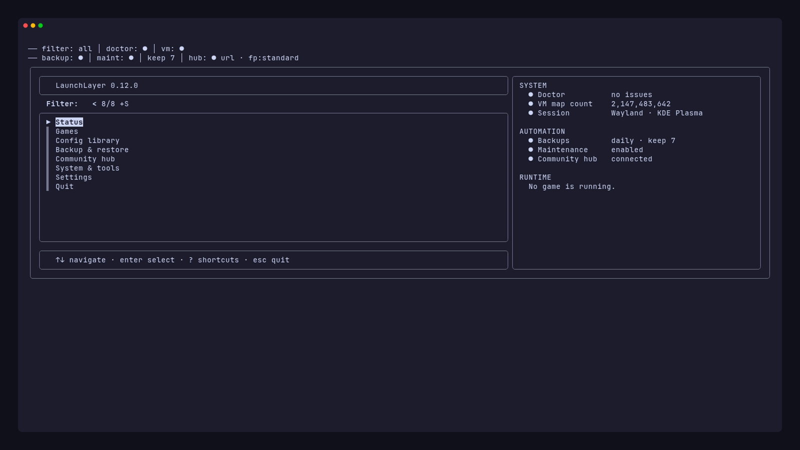
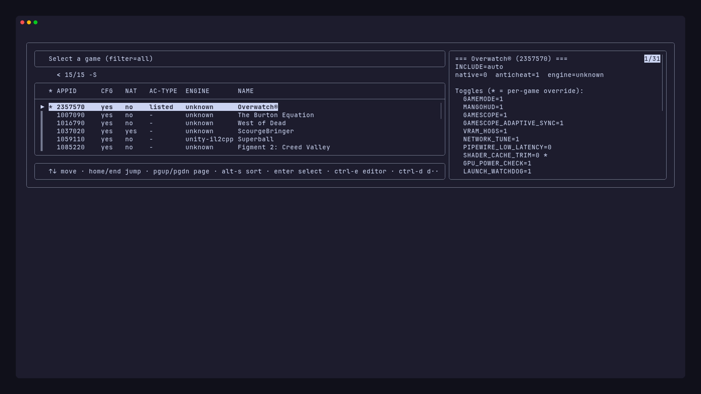
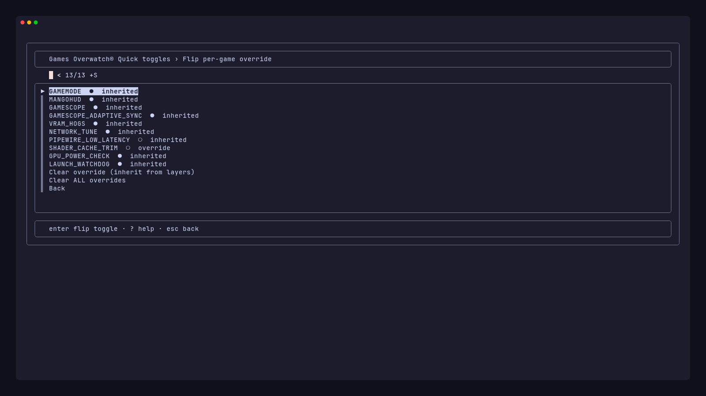

# Interactive TUI

```bash
./launchlayer --tui          # always opens the TUI (interactive terminal required)
launchlayer                  # same when symlinked, and opens TUI with no args when fzf + TTY
```

The TUI requires an interactive terminal. With [fzf](https://github.com/junegunn/fzf), it uses searchable lists, bordered headers, footer shortcuts, and a reverse layout. Without fzf, it presents the same actions as numbered prompts (`1) …`, `Choice:`).

Press **`?`** in any fzf menu to open the shortcuts panel; press Esc to close it. Every fzf menu has a `Filter:` prompt. Hub menus show live status, previews use a split pane, and blank rows separate groups.

[Docs index](README.md) · [README](../README.md) · [CLI](cli.md) · [TUI](tui.md) · [Architecture](architecture.md) · [Third-party](third-party.md) · [Release](release_runbook.md) · [Changelog](../CHANGELOG.md)

Regenerate screenshots after UI changes: `make tui-screenshots` ([VHS](https://github.com/charmbracelet/vhs) + `fzf` required). Source: `scripts/tui-screenshots/`.

---

## Screenshots

### Main menu

The main menu shows a status banner and a live footer for the current filter, doctor result, VM setting, backup timer, and Hub state:

<p align="center">
  
</p>

### Game picker

The game picker searches by name and shows the selected game's config. **Ctrl-E** opens the editor, **Ctrl-D** previews the launch chain, and **?** shows shortcuts. Multi-select hides the preview pane.

<p align="center">
  
</p>

### Game actions

Split view: action list on the left, live config preview on the right (same as the game picker). **Ctrl-D** dry-runs from here too. Blank rows separate View / Edit / Manage / Hub groups.

### Quick toggles

Per-game boolean overrides. Green and red labels mark values set in `GAMES_DIR/<AppID>.env`. Dim text marks inherited layers. Footer: `enter flip toggle · ? help · esc back`.

Covers every 0/1 launch flag (GameMode / MangoHUD / Gamescope family, shader/compatdata checks, NVIDIA power, Proton/`PROTON_*_UPGRADE` / indicators / NVIDIA libs, Arch latency knobs, `DISABLE_STEAM_DECK`, `DLSS_SWAPPER` cycles `0`→`1`→`dll`→`0`, etc.). Assist-only toggles (`DEPTH3D`, `GEO11`, `SBS_VR`, `FLAT2VR`) show an `assist` suffix: path/env markers, not injectors. Prefer `FLAWLESS_WIDESCREEN` over the Advanced-only `FWS` alias. Use **Advanced config → Proton & tools** for specialty runtime pickers, or **Open in $EDITOR**.

<p align="center">
  
</p>

### Advanced config

String and numeric keys, grouped:

| Group | Keys |
|-------|------|
| Change INCLUDE preset | `INCLUDE=presets/…` |
| Proton & tools | `OVERRIDE_PROTON`, `DLSS_SWAPPER` (picker), `FRAME_RATE`, `ENABLE_HDR`, `MALLOC_ALLOCATOR`, `SPECIALTY_RUNTIME` (picker) |
| Gamescope | `GAMESCOPE_W/H/R`, FSR sharpness, `GAMESCOPE_ADAPTIVE_SYNC` (picker: empty/`auto`/`0`/`1`), extra args, output/frame limits, filter, native ReShade effect/technique, focused/unfocused FPS |
| Inject & Wine | vkBasalt/lsfg paths, winetricks verbs, Special K / ReShade / OptiScaler proxy picker / Depth3D / FWS / Conty / OpenVR sources, ValvePlug paths, fetch URL/version |
| Shader & storage | `SHADER_CACHE_MAX_GB`, `SHADER_CACHE_BOOST_GB`, `SHADER_CACHE_CHECK_INTERVAL_HOURS`, `COMPATDATA_MAX_GB`, `VM_MAX_MAP_COUNT_MIN` |
| Affinity & network | `X3D_CPUS`, `CPU_AFFINITY_RANGE`, `GAME_NIC`, `GPU_SELECT` picker, `GPU_SELECT_DRIVER` |
| VRAM & preflight | `VRAM_HOG_UNITS`, `VRAM_HOG_PIDS`, `VRAM_PREFLIGHT_MIN_MB`, `DISK_PREFLIGHT_MIN_GB`, `GPU_VRAM_PROCESS_MIN_MB` |
| HUD & hooks | MangoHUD config paths, `PRE_LAUNCH_CMD` / `POST_LAUNCH_CMD`, `REPLAY_TOOL` (picker), crash-guess timeout (`CRASH_GUESS=1` defaults to 5s) |
| Wrappers & args | `GAME_EXTRA_ARGS`, `LAUNCH_WRAPPERS`, `LAUNCH_WRAPPERS_BEFORE`, `UNSET_VARS` |

Game picker preview shows a **hot** toggle subset plus any per-game overrides (not all ~70 flags).

Third-party licenses and purchase gates: [third-party.md](third-party.md). Matching CLI keys: [cli.md](cli.md) (Wine inject · Gamescope nest · capture).

Press Enter on an empty prompt to keep the current value. Type `-` to clear it. Validation runs after each edit.

---

## On launch

With fzf, Hub menu commands write their output to the right preview pane. Highlight **Status** on the main menu, or open the Status menu, to show the grouped dashboard there. The footer retains its one-line summary.

Without fzf, the two-line status banner prints above the numbered menu as before:

```
── filter: all │ doctor: ● │ vm: ●
── backup: ● │ maint: ◑ │ keep newest 7 after backup │ ○ fp:minimal
```

**Glyphs:** ● active · ○ inactive · ◑ installed but not enabled · ⚠ caution · ✕ error · `—` unavailable. Game-list CFG/NAT values use ●/○. An anticheat `-` is displayed as `—`.

For terminals, fonts, or assistive technology that do not handle those symbols well, enable **Settings → Interface → UI behavior → Text status labels** or run `launchlayer --tui-prefs set text_status 1`. Statuses then use words such as `on`, `off`, `yes`, `no`, `warn`, and `n/a`; fzf also uses an ASCII `>` pointer. Disable motion with **Animated progress** in the same menu or `launchlayer --tui-prefs set spinner 0`. `NO_COLOR=1` remains available independently.

---

## Main menu

The header shows `LaunchLayer <version>` using `LAUNCHLAYER_VERSION`. The footer shows live status, e.g. `filter:all · doctor:0 · vm:ok · backup:off · maint:off · hub:not configured · fp:minimal`. Optional prefix rows appear first when applicable:

```
LaunchLayer <version>                       ← fzf --header
────────────────────────────────────────
Doctor ⚠2                                   ← only when doctor finds issues
▶ Resume: Games                            ← when a previous hub was saved
Status                                     ← sidebar shows grouped health/timers/hub
Games
Config library
Backup & restore
Community hub
System & tools
Settings
Quit
```

With **auto-resume** enabled (`Settings → Interface → [UI]`), the saved hub opens immediately instead of showing this menu.

### Settings › `tui.conf · backup.conf · hub.conf`

Single entry point for all preference files:

- **Interface**: `tui.conf` (games filter, UI behavior, cache threshold, fzf layout)
- **Backup**: `backup.conf` + systemd timer (same as **Backup & restore → Settings**)
- **Community hub**: `hub.conf` (same as **Community hub → Hub settings**)

### Status › At-a-glance system health

Sidebar shows grouped rows (Health, Automation, Library, Community). Actions run doctor / runtime / detect checks; output appears in the sidebar. **Runtime status for game** picks a title and runs `--status APPID` (cache sizes for that game). **Launch stats** summarizes all of `launch.log` (same as `--launch-stats` without AppID).

---

## Submenus

Exact labels from the TUI.

### Games › `(filter: all)`

- Browse & configure game
- Recent games
- Bulk change INCLUDE preset: choose current filter · all configured · **name substring (grep)** · multi-select, then **Preview (dry-run)** or **Apply**
- Init unconfigured games
- Prune uninstalled configs

Game picker filter lives in **Settings → Interface → [Games]** (footer still shows `filter:…`).

### Games › *Game* › Actions `(config ok | validation issues | inherits layers)`

- `[View]` Resolved config · Dry-run launch chain · Paths · Launch stats · Runtime status
- `[Edit]` Quick toggles (all 0/1 flags) · Advanced config (grouped string/numeric keys) · Suggest from ProtonDB · Clear override · Open in `$EDITOR` · Set preset (re-init)
- `[Manage]` Validate config · Delete per-game config
- `[Hub]` Community configs

**Suggest from ProtonDB** opens Preview / Apply (same as `--suggest-config` / `--suggest-config --apply`). Allowlisted knobs only; network required.

### Game picker (fzf)

Header: `Select a game (filter=…)` · Footer: `↑↓ filter · enter select · ctrl-e editor · ctrl-d dry-run · ? help · esc back`

- `[recent]` rows sort to the top
- Live preview via `--tui-game-preview`
- **Ctrl-E** → `--edit-appid`
- **Ctrl-D** → `--dry-run`
- **?** → keyboard shortcuts panel

### Config library › Layers & validation

- Edit `launch.d/default.env` / `local.env` · Show detected defaults · Write local.env from detection
- Anticheat & detections · Edit machine profile · Edit gameplay preset
- Validate default + presets · Validate all game configs

### Backup & restore › `(prune policy │ backup: ● │ maint: …)`

- Settings · Backup actions · Restore from backup · Export & import · Prune archives

**Restore from backup** offers replace and merge (skip existing) for latest archive, picked archive, and per-game restore from latest (same as `--restore-backup --merge` / `--replace`).

**Settings** (also under **Settings → Backup**): five compact rows, each opens a detail submenu when needed:

| Row | Opens / shows |
|-----|----------------|
| `[Path]` | Backup directory |
| `[Keep]` | Archive count · auto-prune ●/○ |
| `[When]` | Schedule preset · jitter seconds |
| `[Pack]` | local · profiles · tui includes |
| `[Timer]` | units · scheduling · manual start |

Footer: `[·] Show all` · Reset · Save. Saving auto-refreshes installed systemd units.

### Community hub › `(url · fp:minimal | not configured · fp:minimal)`

- Hub settings · Machine fingerprint · Similar machines
- Recommend configs (pick game) · Publish config · Update shared configs · Delete config by ID · Apply config by ID
- Publish/update flows support optional **config ID** and **include-new** (same as `--config-id` / `--include-new` on the CLI)
- **Apply config by ID** and recommend pickers both support Preview · Apply · View history · Apply historical version (`--hub-history` / `--hub-apply --history`)

### System & tools › Diagnostics & setup

- Doctor · Detect environment · Runtime status · Launch stats · CPU topology · vm.max_map_count
- VRAM hogs & launch cleanup · Cache report · Setup / onboarding (includes **Backup timer settings**)

### Interface › `tui.conf`

Four compact rows + footer:

- `[Games]` filter · preset: opens filter/preset picker
- `[UI]` json · resume · pause: JSON/resume toggles + press-enter threshold
- `[Cache]` min N GB
- `[fzf]` height · preview layout
- `[·] Show all` · Reset · Save and return · Back without saving

### Hub settings › `hub.conf`

- `[Hub]` URL · `[Auth]` token ●/○ · `[You]` machine label · `[Privacy]` fingerprint level
- `[·] Open hub.conf in $EDITOR` · Show all · Reset · Save

Publish/delete require a matching Convex `HUB_PUBLISH_TOKEN` (fail closed). Token value is stored in `hub.conf` (`chmod 600` on save) and never printed by `--hub-prefs set`. Apply strips remote-exec keys before writing a game `.env`. CLI twins: [cli.md § Community hub](cli.md#community-hub). Internals: [architecture.md](architecture.md) · [README § Community hub](../README.md#community-hub).

---

## Keyboard shortcuts

| Context | Keys / footer |
|---------|----------------|
| All fzf menus | Type to filter · ↑↓ navigate · Enter select · Esc back · **?** help |
| Main menu | Live status footer. **Ctrl-D** runs doctor when issues are reported. |
| Games hub | Footer adds `filter:… · N games` |
| Game actions | Preview pane · **Ctrl-D** dry-run · grouped rows (View / Edit / Manage / Hub) |
| Game picker | **Ctrl-E** editor · **Ctrl-D** dry-run · preview pane |
| Quick toggles | `enter flip toggle` footer |
| Multi-select | Tab toggle · no preview pane |
| Backup / hub hubs | Footer shows prune policy or hub status |

Without fzf, numbered menus still work. Preview, multi-select, footer hints, and **?** help require fzf.

---

## Highlights

- Breadcrumb headers use ` › ` (e.g. `Games › Overwatch 2 › Quick toggles`)
- Quick toggles show inherited vs per-game override coloring when the terminal supports it
- JSON view mode (`Settings → Interface → [UI]`) makes view commands emit `--json` output, pretty-printed when `jq`/`python3` is available
- Long output only pauses at "Press Enter to continue…" when it spans `press_enter_lines` (default 8)

---

## Preferences

Files in `~/.config/launchlayer/`:

| File | Template |
|------|----------|
| `tui.conf` | `share/launchlayer/templates/tui.conf.example` |
| `backup.conf` | `share/launchlayer/templates/backup.conf.example` |
| `hub.conf` | `share/launchlayer/templates/hub.conf.example` |

Reset via `--tui-prefs reset`, `--backup-prefs reset`, `--hub-prefs reset`, or **Settings** (Interface / Backup / Hub panes) and the matching hub shortcuts.

---

## See also

- [Docs index](README.md): topic → canonical page map
- [cli.md](cli.md): full command tables (same underlying handlers)
- [third-party.md](third-party.md): licenses / inject policy
- [architecture.md](architecture.md): CLI/TUI parity and `lib/tui/`
- [README § Interactive TUI](../README.md#interactive-tui)
